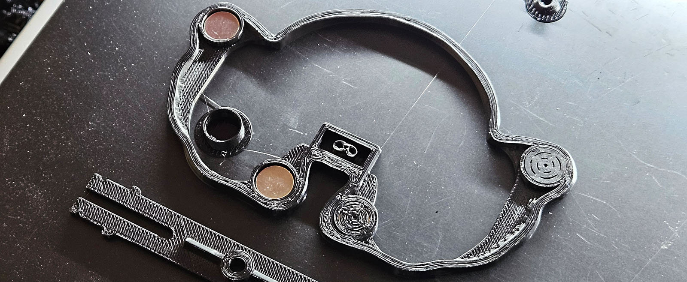
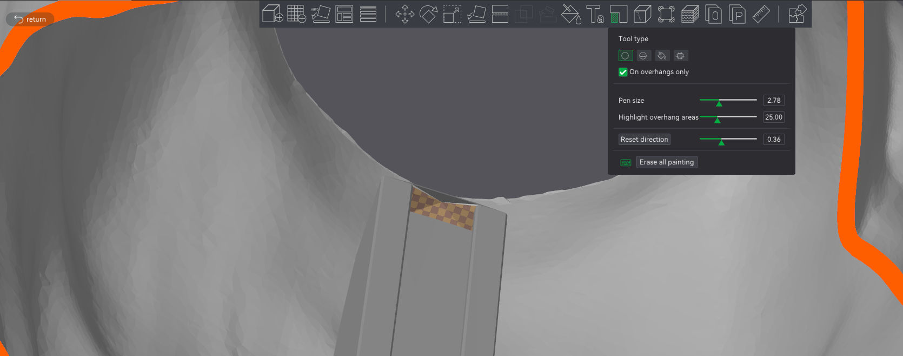
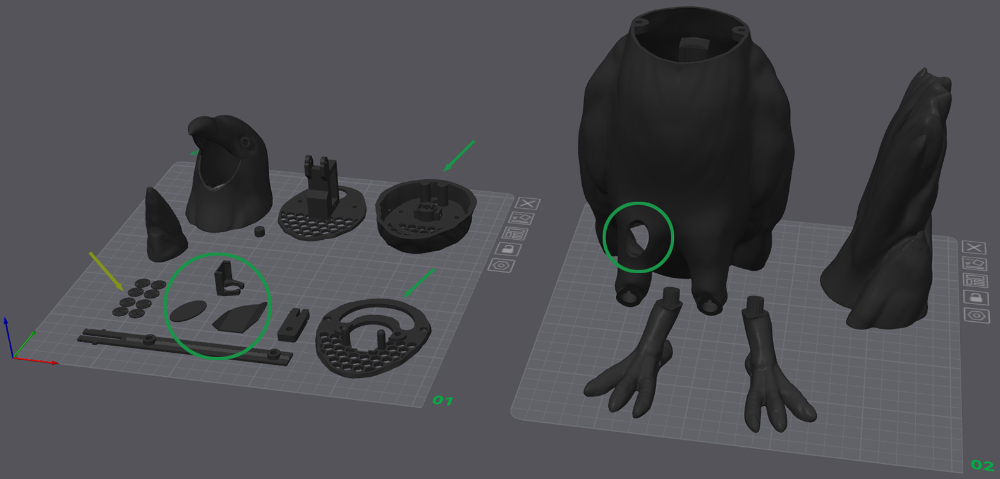
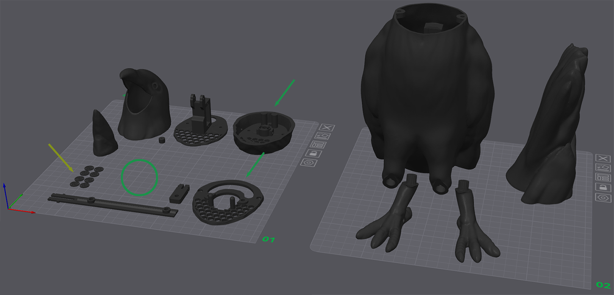

# 3D-Druckanleitung #
Drucke die Teile in der Ausrichtung, wie auf den Bildern unten gezeigt.  
PETG ist eine gute Wahl, wenn du ein wetterbeständigeres Material möchtest – aber beachte: Das Modell ist **nicht** wetterfest konstruiert.

### Benötigte Teile für den Druck ###

| Menge | Teil                   | Hinweis                        |
|-----|------------------------|-----------------------------|
| 8   | 10×3 mm Neodym-Magnete | Für die Verbindung zwischen Schwanz und Körper. |
|     | Sekundenkleber       | zum Fixieren der Magnet-Unterlagen.        |

## Wichtiger Hinweis: ##
 
Die Magnetöffnungen sind geschlossen – du musst den Druck pausieren, um die Magnete einzusetzen.  
Die Aussparungen sind 3,5 mm hoch. Bei einer Schichthöhe von 0,16 mm pausiere ich z. B. bei Schicht 25.

**Miss deine Magnete nach!**  
Meine sind 2,66 mm hoch. Um etwas Spiel zu lassen, skaliere ich die Z-Höhe der 1,0 mm Shims (gelbe Pfeile unten) auf 80 %.

Achte auf die **richtige Polarität** der Magnete!  
Markiere die Seiten für „Körper“ und „Schwanz“, damit du sie nicht verwechselst.  
Ich gebe einen Tropfen Sekundenkleber auf die Unterlage und klebe ihn auf den Magneten, bevor ich den Druck fortsetze.

## Zweiter Hinweis: ##
Der Krähenkörper ist so konstruiert, dass er mit minimalen Stützstrukturen gedruckt werden kann (nur an den „Knöcheln“ nötig).  
Mein Slicer (Bambu) möchte eine riesige Stütze für die winzige Spitze der PCB-Halterung erzeugen.  
Ich markiere diesen Bereich als „nicht stützen“ – spart Material.

Kleiner Hinweis am Rande:  
Die schräge Unterseite des Schnabels **muss** bei mir gestützt werden – deine Ergebnisse können abweichen.

## Dritter Hinweis: ##
Stepper-Kragen gleitet auf der Stepper-Platte.  
Ich drucke diese beiden Teile (grüne Pfeile unten) mit aktivierter „Ironing“-Funktion, um die Oberfläche zu glätten.  
Nach dem Druck schleife ich sowohl die Kuppelhalterungen auf der Körperplatte als auch die Gleitfläche des Kragens mit 800er Schleifpapier.  
Vor dem Zusammenbau kommt noch etwas Trockenschmiermittel drauf.

# Krähe mit PIR-Sensor-Fenster  #

### PIR-Komponenten (grün markiert)  ###

*Nicht abgebildet:* Der Schnabel-Aktuator *(empfohlen mit 0,2 mm Düse drucken)*
* Eine Halterung für den PIR-Sensor *(ebenfalls 0,2 mm Düse empfohlen)*
* Eine innere Abdeckung (verhindert, dass der Sensor die Kopfbewegung der Krähe erkennt)
* Krähenkörper mit Aussparung für das PIR-Fenster
* Ein Oval zum Abdecken des PIR-Fensters
* Füße mit oder ohne Loch funktionieren – das Loch ist für Kabelbinder oder Drahtbefestigung gedacht

# Krähe ohne Sensor oder mit Radarsensor #

* *Nicht abgebildet:* Der Schnabel-Aktuator. *(Empfohlen: Druck mit 0,2 mm Düse.)*
* *Nicht abgebildet:* Eine Radarhalterung gehört in den grünen Kreis (wird ergänzt, sobald ich den LD1020 habe)
* Krähenkörper **ohne** Fenster-Aussparung
* Füße mit oder ohne Loch funktionieren – das Loch ist für Kabelbinder oder Drahtbefestigung gedacht
