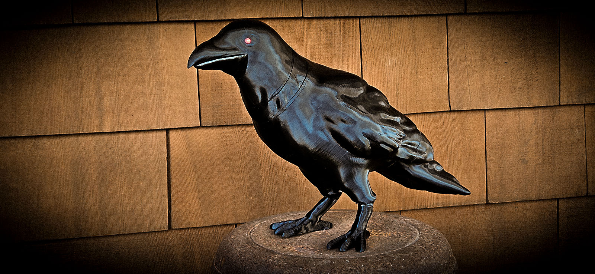
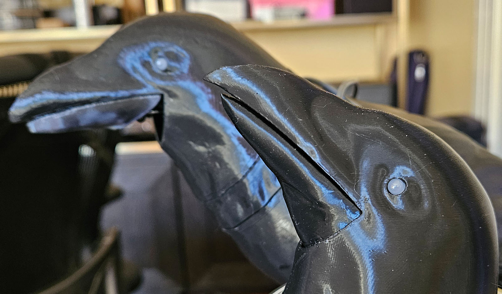

# Animatronic Crow
Basierend auf Designs von Thingiverse:
[Animatronic Halloween Crow by andymcculloch](https://www.thingiverse.com/thing:6278223)
und [Animatronic Halloween Crow by Doctor_JohnSmith](https://www.thingiverse.com/thing:6258153)
die wiederum Remixes von [danman](https://www.thingiverse.com/danman/designs)
der das ursprüngliche Modell von YahooJAPAN überarbeitet hat [YahooJAPAN](https://www.thingiverse.com/yahoojapan/designs).

Meine Arbeit wurde mit [KiCad](https://www.kicad.org/),
[FreeCAD](https://www.freecad.org/),
und [Blender](https://www.blender.org/download/releases/4-4/) umgesetzt.

Ich (swaziloo oder padpumpkin) haben eventuell noch ein paar Platinen übrig (zum Selbstkostenpreis + Versand).  
Schreib mir/uns einfach, wenn du Interesse hast.

___
## [3D-Druckanleitung für die Krähe](3d-druckanleitung.de.md) ##
___
## [Bauanleitung für die Krähe](BUILD.de.md) ##
___

### Modifikationen und Modellquellen: ###

| Modell                    | Quelle           | Modifikation                                                                                                                                                                                                                                                                                                                                                                                     |
|--------------------------|------------------|---------------------------------------------------------------------------------------------------------------------------------------------------------------------------------------------------------------------------------------------------------------------------------------------------------------------------------------------------------------------------------------------------|
| Gesamtmodell                   |                  | Einheitliche Verwendung von M3 x 4 (oder 5) x 5 Einschmelzgewindeeinsätzen und M3-Schrauben.                                                                                                                                                                                                                                                                                                         |
| Kopf                     | andymcculloch    | Schnabelform verfeinert, um eine spitzere Form zu erzielen. Unteren Schnabelausgang geglättet/abgeschrägt. Befestigungen entfernt und leicht verbreitert sowie gekürzt neu aufgebaut, damit sie unter den SG90-Servo passen.                                                                                                                                                                           |
| Schnabel                     | Doctor_Johnsmith | Untere Kragenform hinzugefügt, die im Kopf sitzt, ohne dass ein Ausschnitt sichtbar ist. Befestigungsschiene neu gezeichnet und separate Befestigungslöcher für den Aktuator hinzugefügt. Modell so geschnitten, dass es stehend gedruckt werden kann.                                                                                                                                         |
| Schnabel-Servo-Platte   | andymcculloch    | Verbindungsturm angepasst, damit der größere Schnabel vollständig geöffnet werden kann. SG90-Halterung begradigt und Befestigungslöcher verkleinert, passend zu den mitgelieferten Schrauben. Sechseckiges Gitter für Sound hinzugefügt. M3-Schraublöcher verschoben und Kabeldurchführung verkleinert.                                                                                        |
| Stepper-Kragen (Kopf)      | andymcculloch    | Stepper-Zentrum verschoben. Kabelöffnung verkleinert und Ausrichtungsstifte hinzugefügt. Sechseckiges Gitter für Sound mit Führung für Kopf-Drehstifte ergänzt. M3-Schraublöcher verschoben.                                                                                                                                                                                                  |
| Stepper-Platte (Körper)  | Andymcculloch    | Stepper-Zentrum verschoben. Bogenförmiger Ausschnitt für Ausrichtungsstifte hinzugefügt. Kopf-Drehstifte ergänzt. Sechseckiges Gitter für Sound hinzugefügt. Kopföffnungen vergrößert für M3-Schrauben.                                                                                                                                                                                               |
| Körper                     | Doctor_Johnsmith | Servo-Platte entfernt und Halterungen für andymcculloch-Stepper-Platte ergänzt. Geschlossenes Gehäuse für 40mm-Lautsprecher hinzugefügt. Interner Kabelring zur Führung. Montageschiene für Creature Control 5x12 PCB ergänzt. Sensorhalterung innen hinzugefügt. PIR-Fenster im rechten Knie (optional). Magnetaufnahmen (10x3mm) eingefasst. Befestigungspunkt für Schwanz ergänzt. |
| Füße                     | Doctor_Johnsmith |  Ausrichtungsstifte und horizontales Loch zur Fixierung (optional) hinzugefügt.                                                                                           |
| Schwanz                     | Doctor_Johnsmith | Magnetaufnahmen eingefasst. Einrastlasche zur Befestigung am Körper (optional). Loch für externe Verbindung vergrößert. Flügelspitzen spitzer gestaltet.                |

### Zusätzliche Teile: ###

| Modell               | Beschreibung                                                                                                                                                                                 |
|---------------------|---------------------------------------------------------------------------------------------------------------------------------------------------------------------------------------------|
| Aktuator            | in druckbarer Arm, der den beweglichen Schnabel mit dem Servo verbindet. Empfohlen wird eine 0,2 mm Düse. (Anmerkung padpumpkin: Ich habe es mit einer 0,4er Düser gedruckt -> funktioniert)    |
| Aktuator-Abstandshalter     | Füllt den Spalt zwischen dem Aktuator und dem SG90-Servoarm. Ebenfalls mit 0,2 mm Düse drucken. (Anmerkung padpumpkin: Ich habe es mit einer 0,4er Düser gedruckt -> funktioniert)      |
| PCB(Platine)-Halterung           | ine kleine Schiene, um das Creature Control 5x12 Board mit M3-Schrauben im Körper zu befestigen.                                                                                   |
| PIR-Halterung           | Hält einen Mini-PIR-Sensor und rastet im rechten Bein ein. Empfohlen wird eine 0,2 mm Düse. (Optional)                                                                                      |
| PIR-Abdeckung           | Interner Sichtschutz, falls dein PIR-Sensor auf interne Bewegungen reagiert, wenn der Kopf der Krähe sich dreht. (Optional)                                                                  | 
| PIR-Fenster-Stopfen      | Verschließt das PIR-Fenster im rechten Knie, falls du es doch nicht nutzen willst. Senkrecht drucken, damit das Muster zur Außenhaut der Krähe passt. (Optional)                           |
| PIR-Fenster-Schablone | Ein druckbares Oval, das genau zur Form des PIR-Fensters passt. Ursprünglich gedacht für eine Abdeckung aus schwarzem IR-durchlässigem Acryl – aber das Material war zu dunkel für gute Erkennung (Optional) |
| LD1020-Halterung        | Hält einen LD1020-Radarsensor und rastet im rechten Bein ein. Empfohlen wird eine 0,2 mm Düse. (Optional)                                                                                   |
| Magnet-Unterlagen        | 0,8 mm und 1,0 mm dicke Abstandshalter, um den Höhenunterschied zwischen echten 10×3 mm Magneten und dem 3,5 mm Hohlraum in Schwanz und Körper auszugleichen. Siehe [3D-Druckanleitung](3d-druckanleitung.de.md).                    |
